# TriggerSearch（trigs）シーケンス図・画面遷移図（更新版）

---

## 1. シーケンス図

### 1.1 毎日の記録を登録する

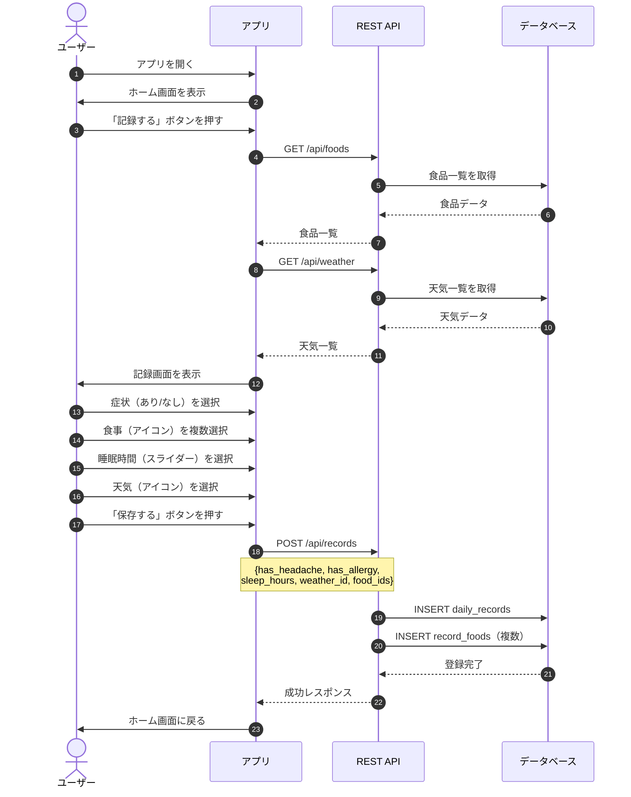

---

### 1.2 トリガー分析結果を見る（データ十分）

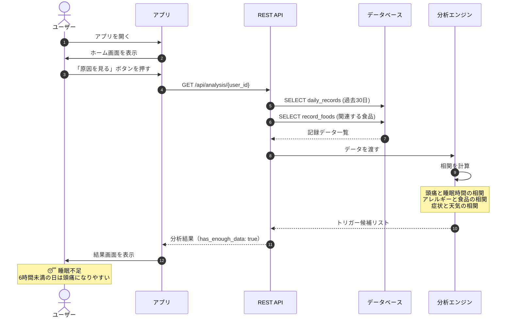

---

### 1.3 トリガー分析結果を見る（データ不足）

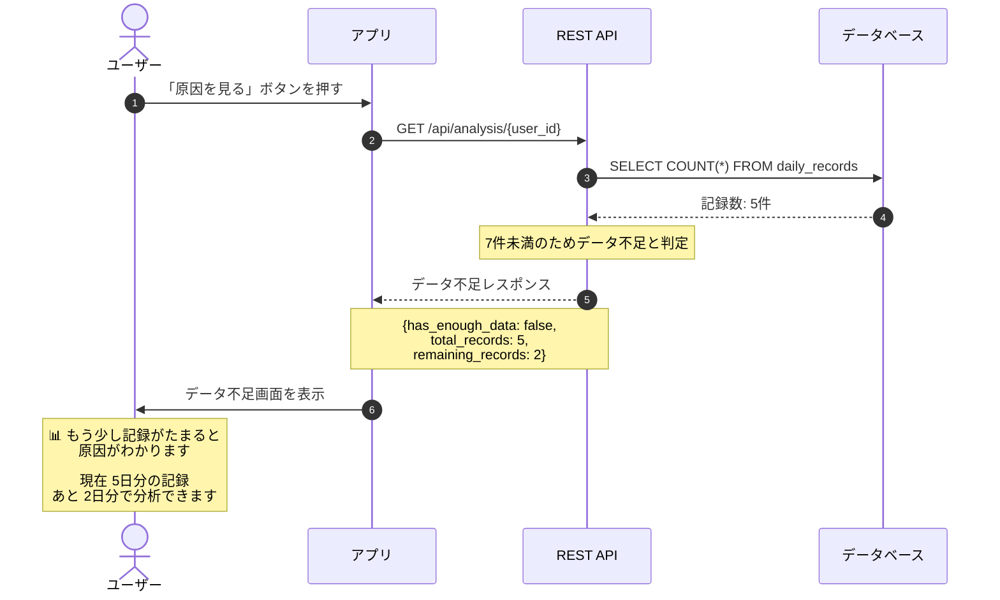

---

### 1.4 ユーザー登録

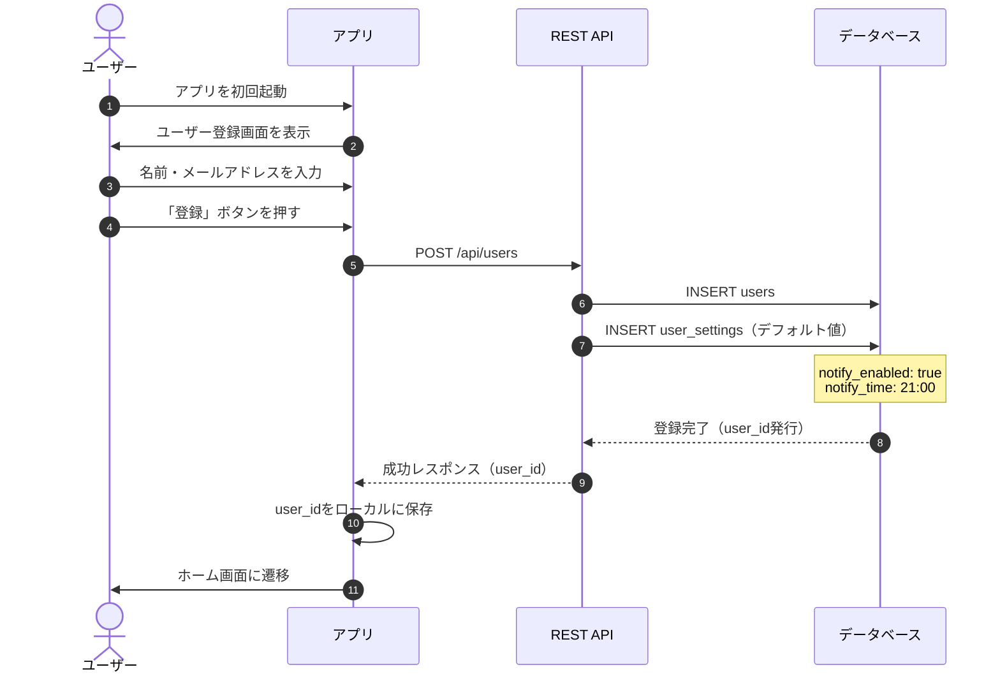

---

### 1.5 通知設定を変更する

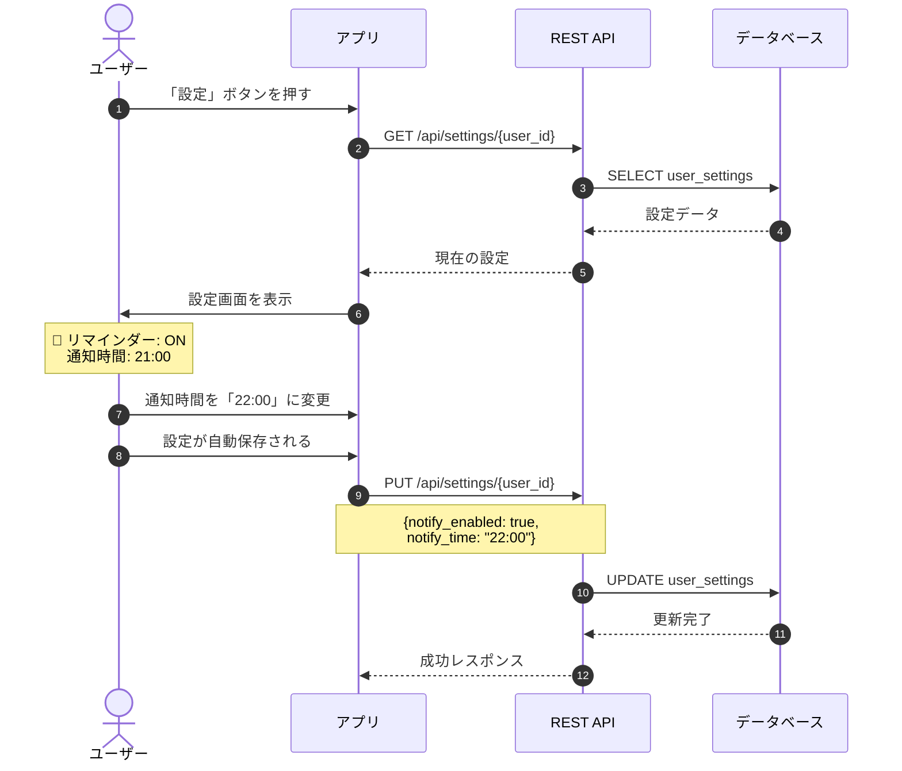

---

### 1.6 夜の通知を受け取る

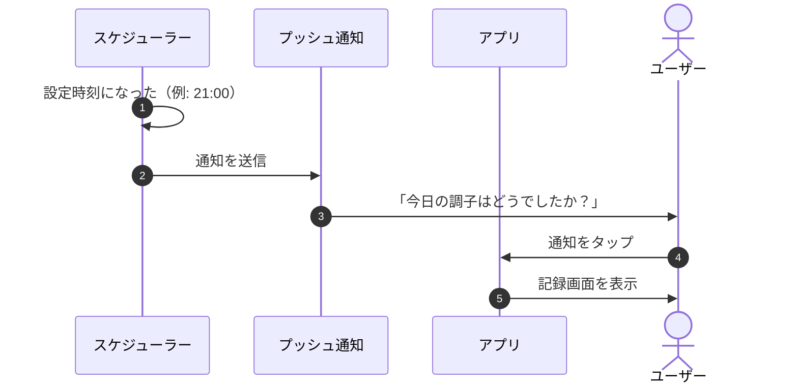

---

### 1.7 過去の記録を修正する

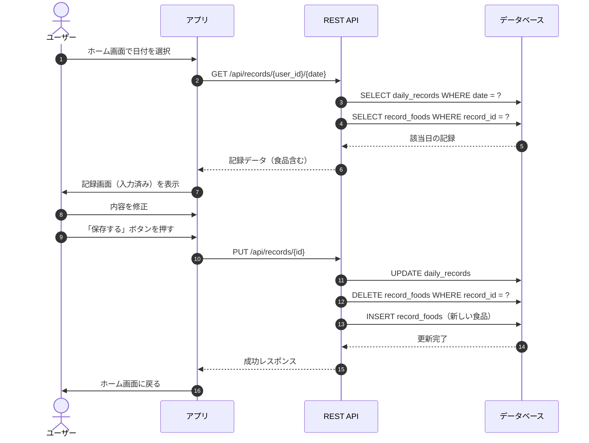

---

## 2. 画面遷移図

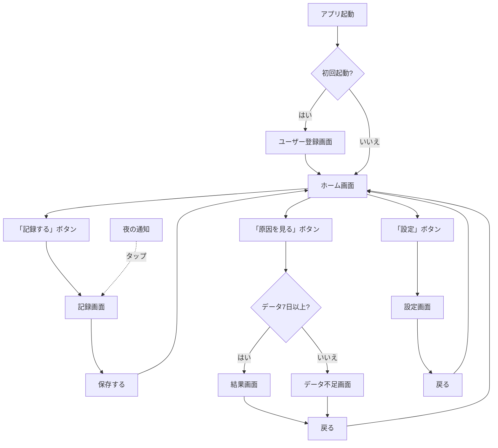

---

## 3. データフロー図

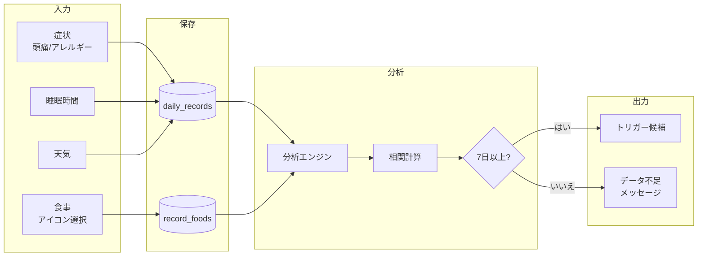

---

## 4. 分析ロジックフロー

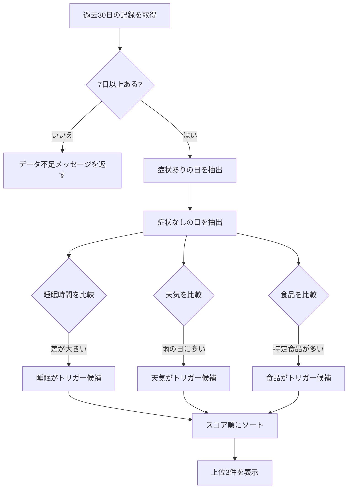

---

## 5. 通知フロー

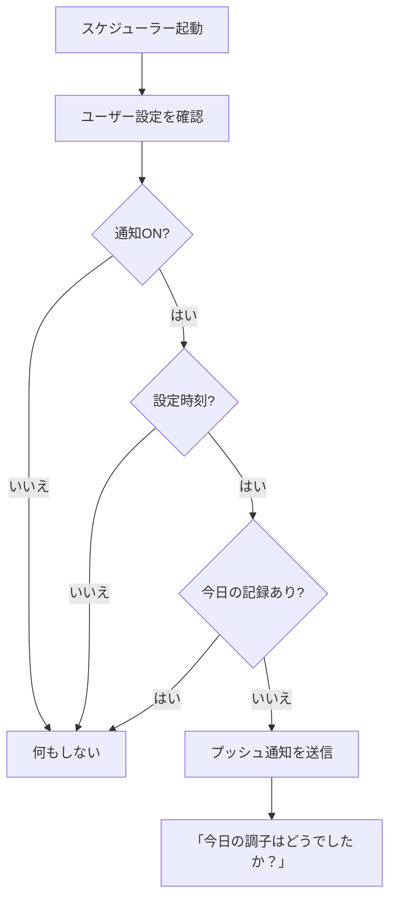

---
