# TriggerSearch（trigs）シーケンス図・画面遷移図（v3）

---

## 1. シーケンス図

### 1.1 今日の記録を登録する

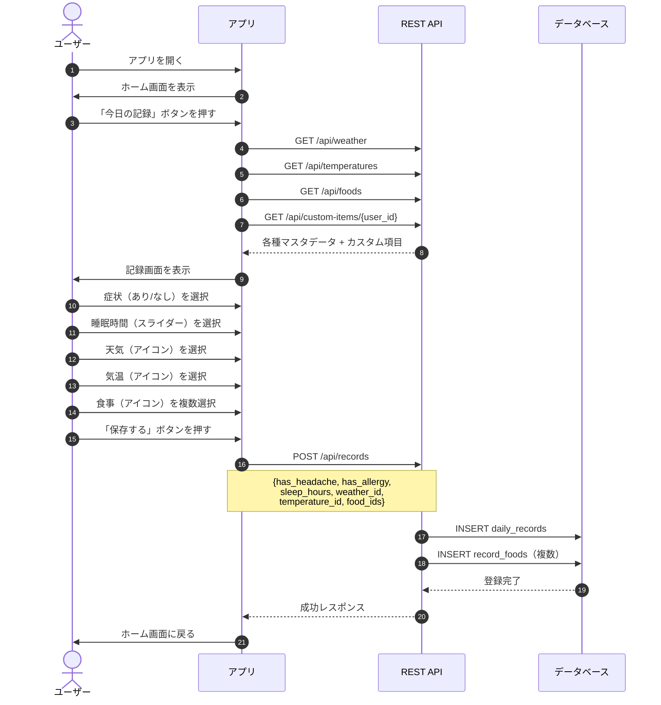

---

### 1.2 カレンダーから過去の記録を確認・編集する

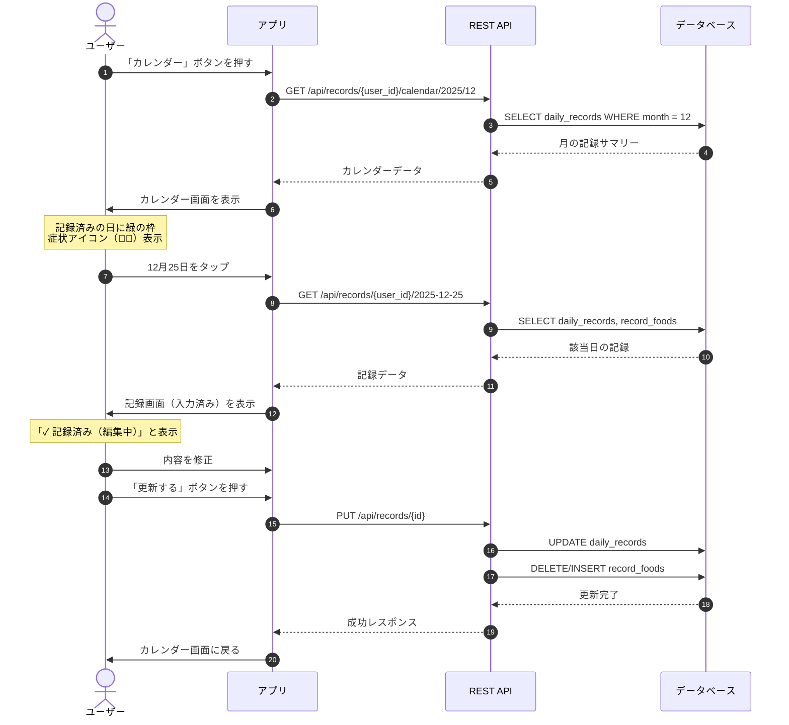

---

### 1.3 記録を削除する

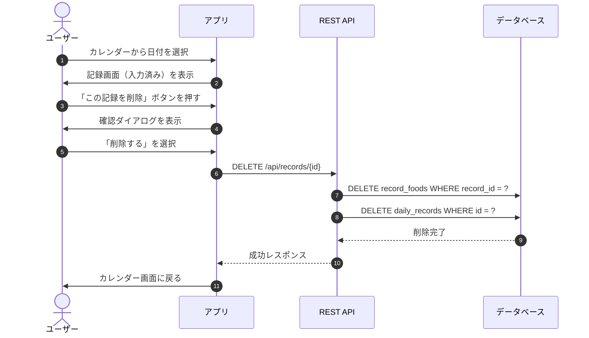

---

### 1.4 カスタム項目を追加する

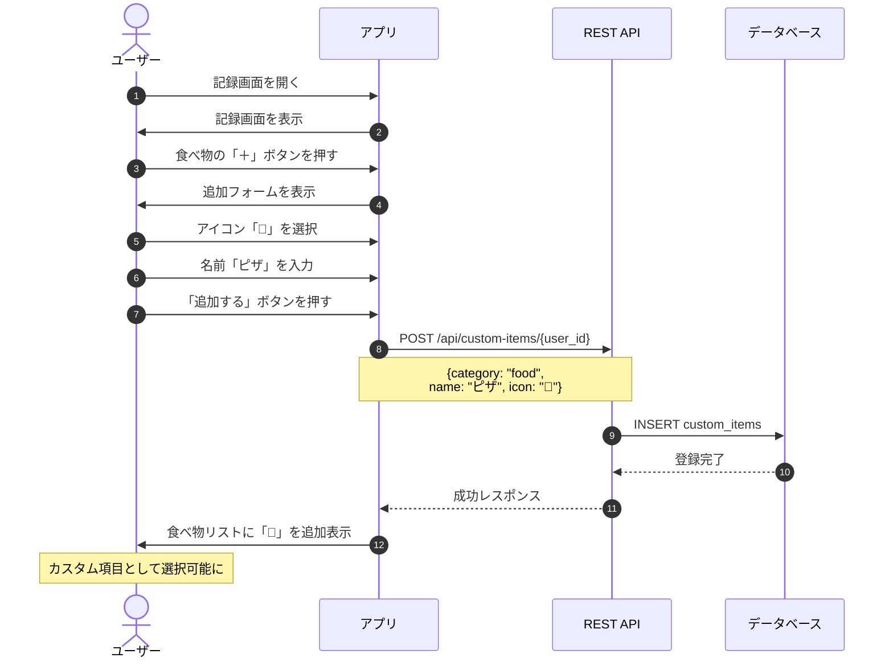

---

### 1.5 カスタム項目を削除する

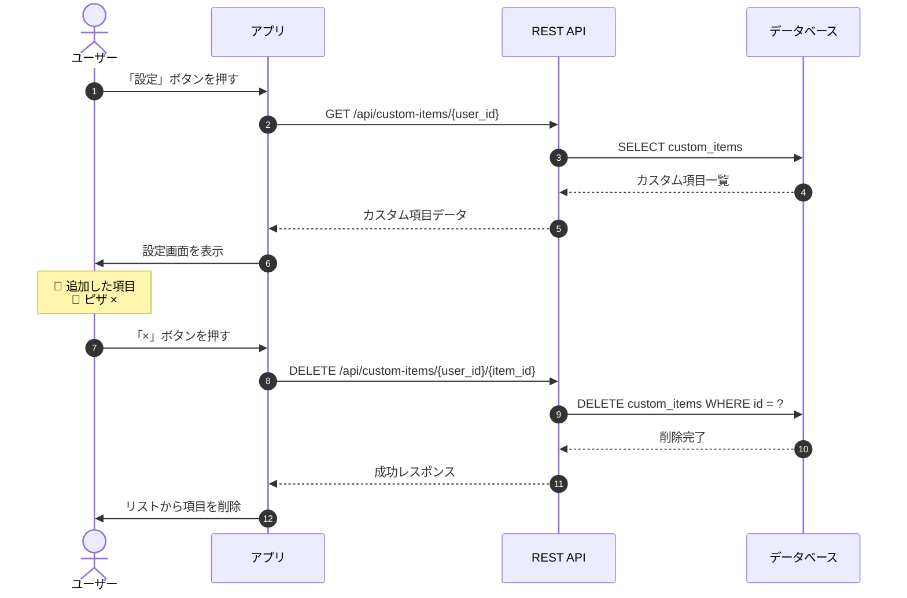

---

### 1.6 トリガー分析結果を見る（データ十分）

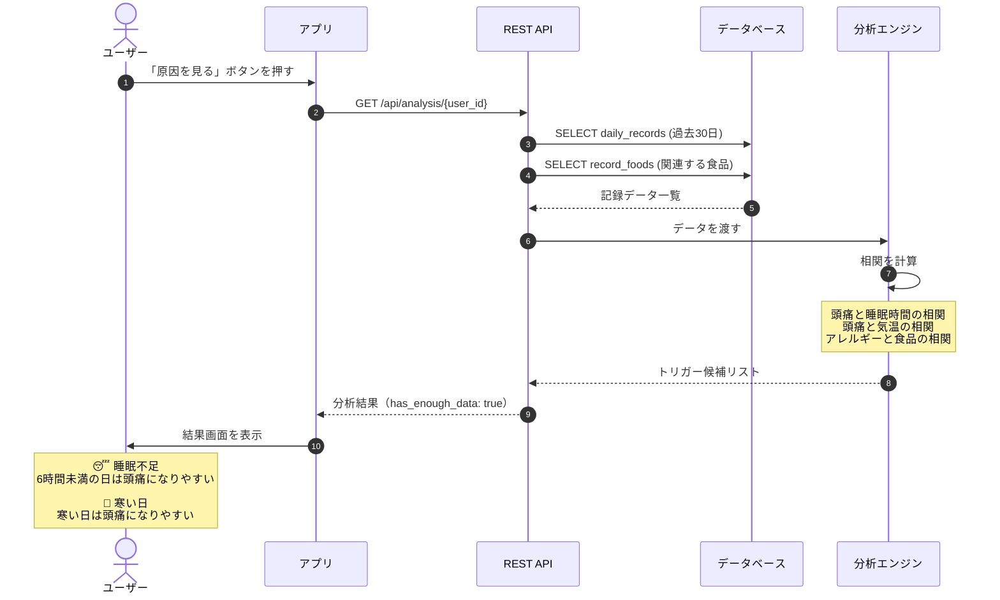

---

### 1.7 トリガー分析結果を見る（データ不足）

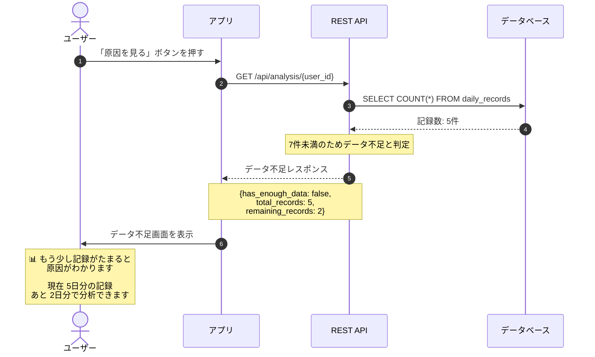

---

### 1.8 通知設定を変更する

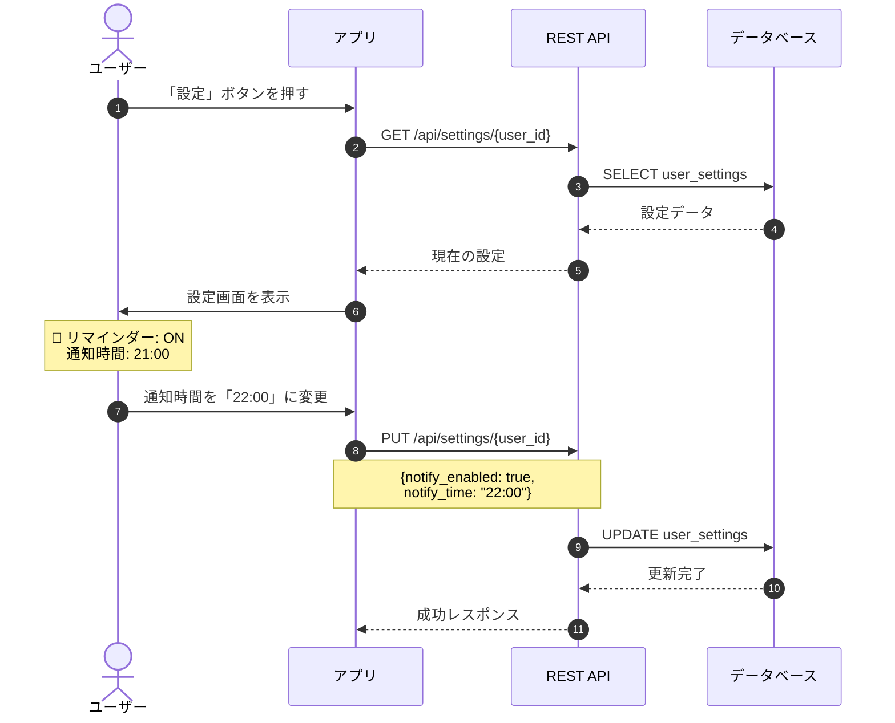

---

### 1.9 夜の通知を受け取る

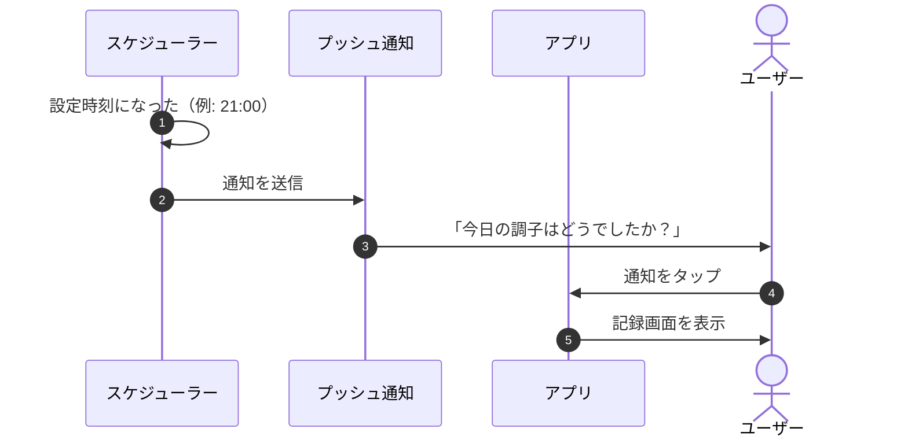

---

### 1.10 ユーザー登録

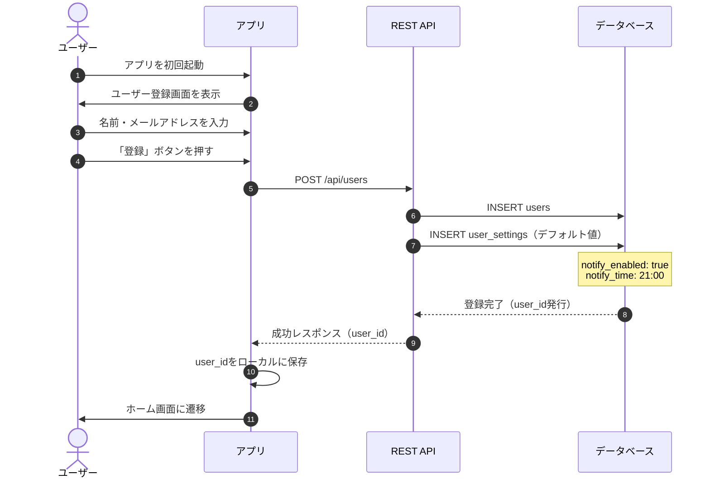

---

## 2. 画面遷移図

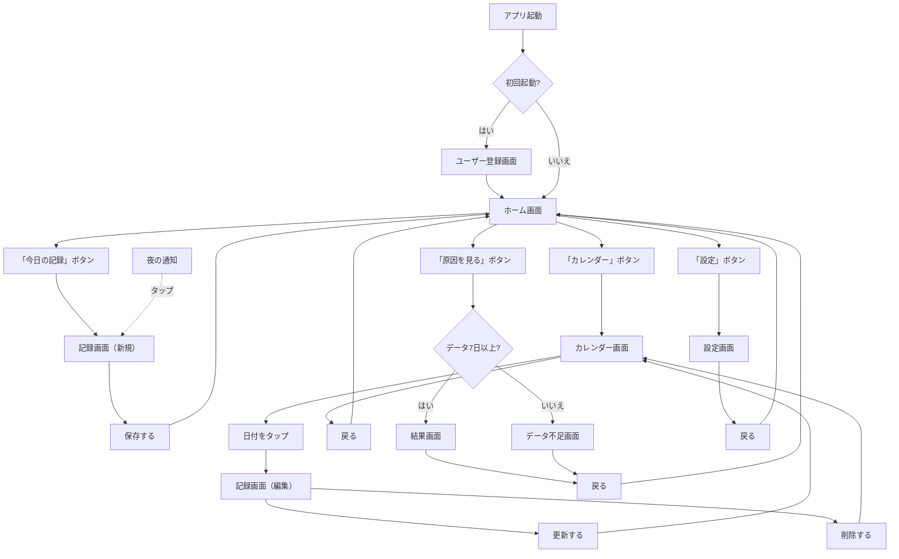

---

## 3. データフロー図

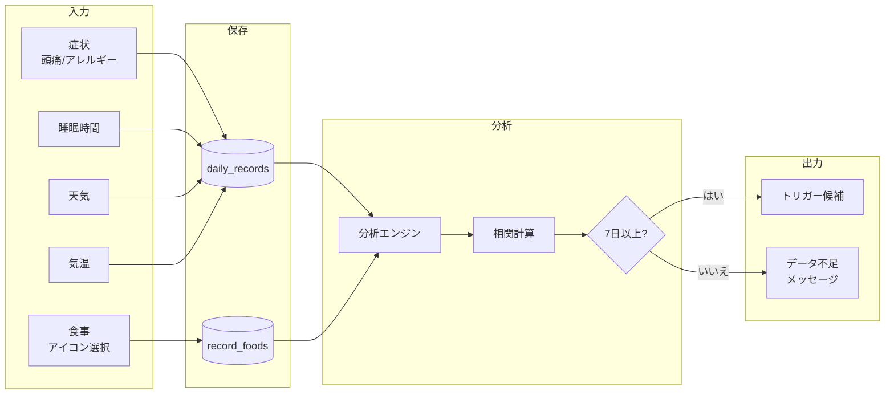

---

## 4. 分析ロジックフロー

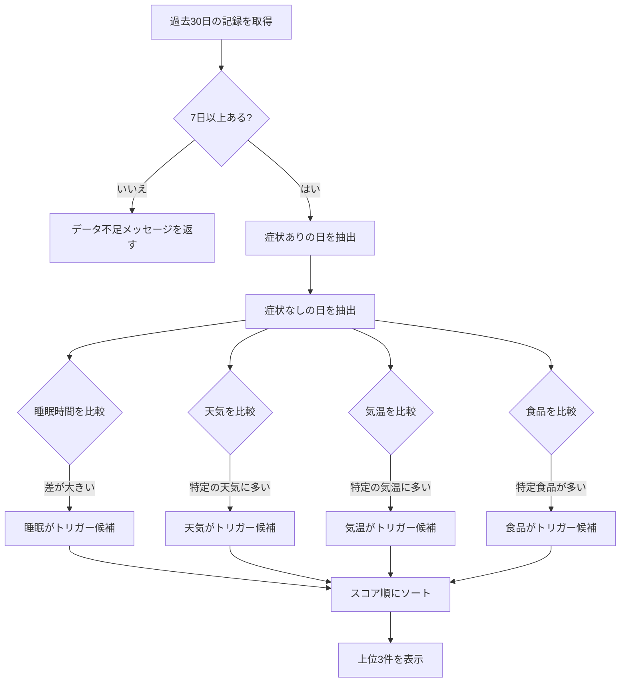

---

## 5. 通知フロー

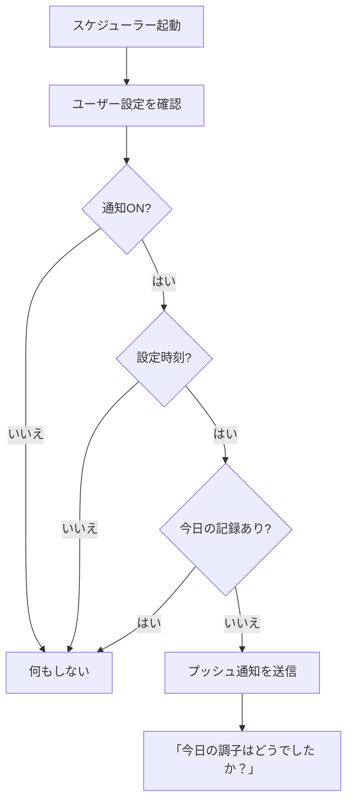

---

## 6. カスタム項目フロー

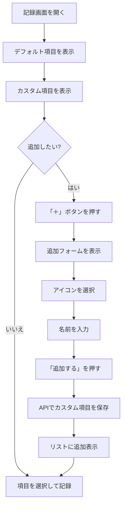

---

以上
