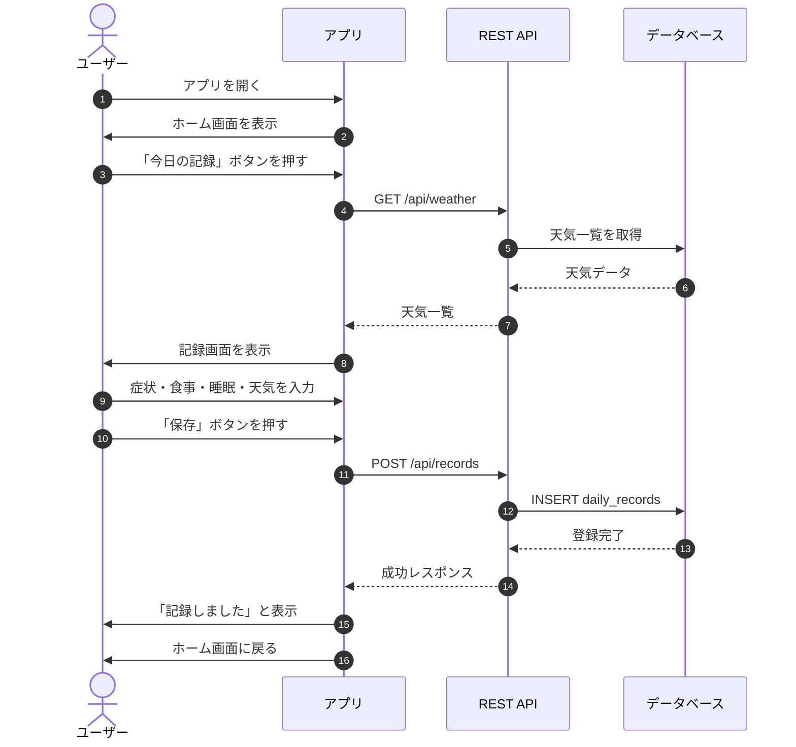
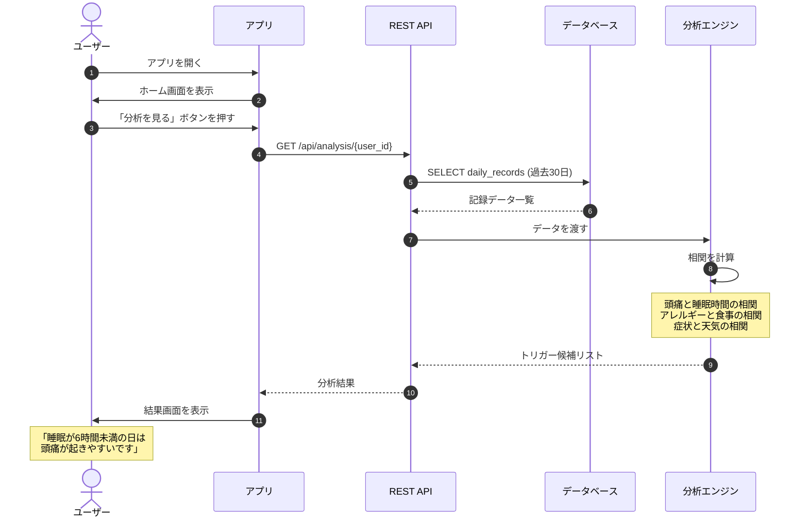
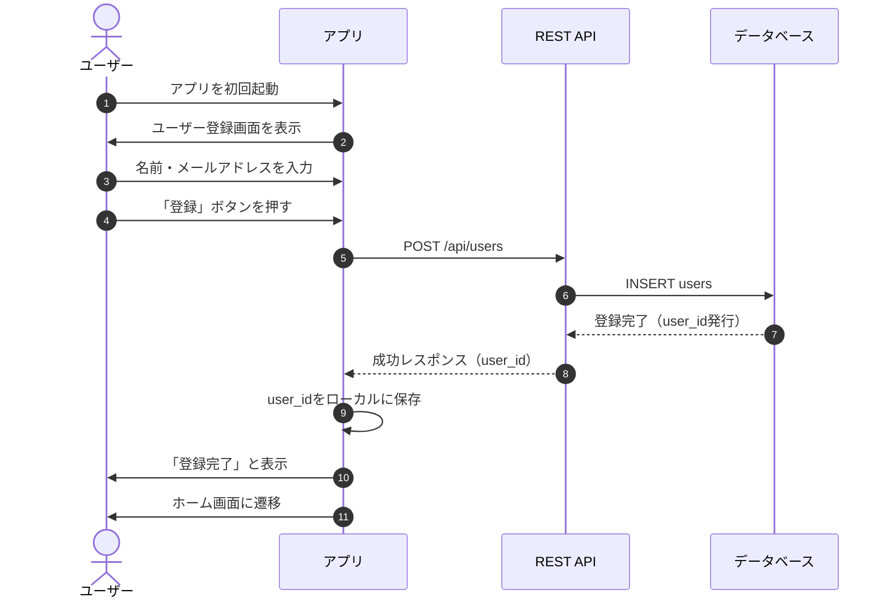
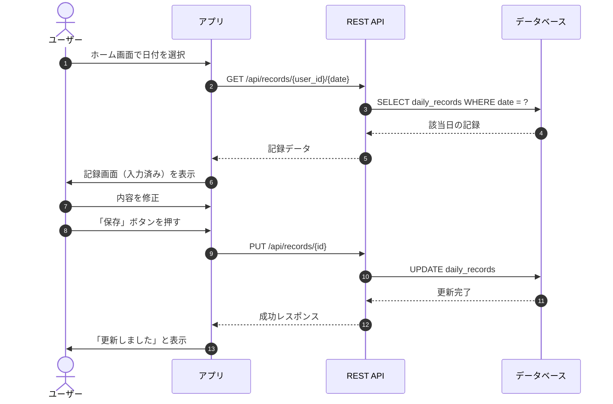
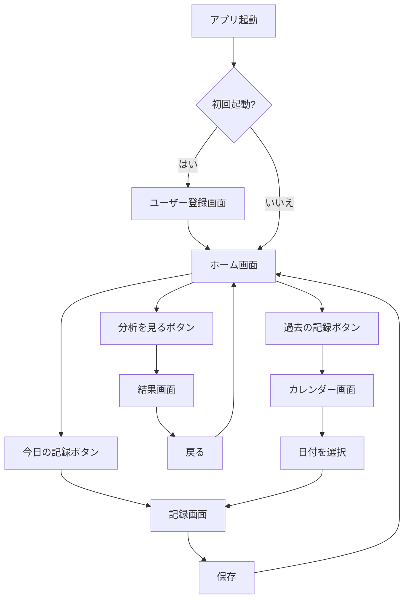
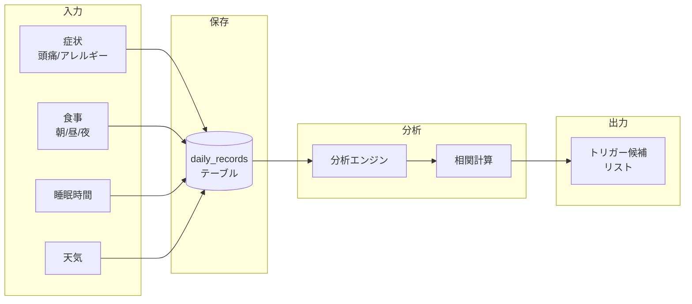
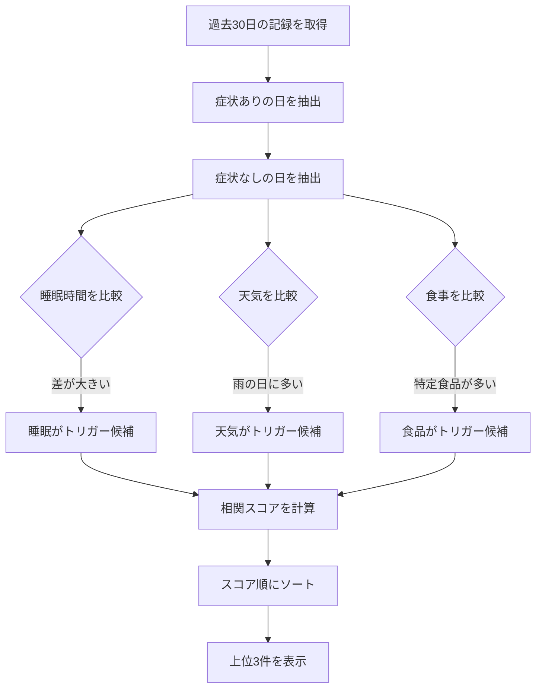

## シーケンス図

### 毎日の記録を登録する

```mermaid
sequenceDiagram
    autonumber
    actor User as ユーザー
    participant App as アプリ
    participant API as REST API
    participant DB as データベース

    User->>App: アプリを開く
    App->>User: ホーム画面を表示
    
    User->>App: 「今日の記録」ボタンを押す
    App->>API: GET /api/weather
    API->>DB: 天気一覧を取得
    DB-->>API: 天気データ
    API-->>App: 天気一覧
    App->>User: 記録画面を表示

    User->>App: 症状・食事・睡眠・天気を入力
    User->>App: 「保存」ボタンを押す
    
    App->>API: POST /api/records
    API->>DB: INSERT daily_records
    DB-->>API: 登録完了
    API-->>App: 成功レスポンス
    
    App->>User: 「記録しました」と表示
    App->>User: ホーム画面に戻る
```

---

### トリガー分析結果を見る

```mermaid
sequenceDiagram
    autonumber
    actor User as ユーザー
    participant App as アプリ
    participant API as REST API
    participant DB as データベース
    participant Analyzer as 分析エンジン

    User->>App: アプリを開く
    App->>User: ホーム画面を表示
    
    User->>App: 「分析を見る」ボタンを押す
    
    App->>API: GET /api/analysis/{user_id}
    API->>DB: SELECT daily_records (過去30日)
    DB-->>API: 記録データ一覧
    
    API->>Analyzer: データを渡す
    Analyzer->>Analyzer: 相関を計算
    Note over Analyzer: 頭痛と睡眠時間の相関<br/>アレルギーと食事の相関<br/>症状と天気の相関
    Analyzer-->>API: トリガー候補リスト
    
    API-->>App: 分析結果
    App->>User: 結果画面を表示
    Note over User: 「睡眠が6時間未満の日は<br/>頭痛が起きやすいです」
```

---

### ユーザー登録

```mermaid
sequenceDiagram
    autonumber
    actor User as ユーザー
    participant App as アプリ
    participant API as REST API
    participant DB as データベース

    User->>App: アプリを初回起動
    App->>User: ユーザー登録画面を表示
    
    User->>App: 名前・メールアドレスを入力
    User->>App: 「登録」ボタンを押す
    
    App->>API: POST /api/users
    API->>DB: INSERT users
    DB-->>API: 登録完了（user_id発行）
    API-->>App: 成功レスポンス（user_id）
    
    App->>App: user_idをローカルに保存
    App->>User: 「登録完了」と表示
    App->>User: ホーム画面に遷移
```

---

### 過去の記録を修正する

```mermaid
sequenceDiagram
    autonumber
    actor User as ユーザー
    participant App as アプリ
    participant API as REST API
    participant DB as データベース

    User->>App: ホーム画面で日付を選択
    
    App->>API: GET /api/records/{user_id}/{date}
    API->>DB: SELECT daily_records WHERE date = ?
    DB-->>API: 該当日の記録
    API-->>App: 記録データ
    
    App->>User: 記録画面（入力済み）を表示
    
    User->>App: 内容を修正
    User->>App: 「保存」ボタンを押す
    
    App->>API: PUT /api/records/{id}
    API->>DB: UPDATE daily_records
    DB-->>API: 更新完了
    API-->>App: 成功レスポンス
    
    App->>User: 「更新しました」と表示
```

---

## 画面遷移図

```mermaid
flowchart TD
    A[アプリ起動] --> B{初回起動?}
    B -->|はい| C[ユーザー登録画面]
    C --> D[ホーム画面]
    B -->|いいえ| D
    
    D --> E[今日の記録ボタン]
    D --> F[分析を見るボタン]
    D --> G[過去の記録ボタン]
    
    E --> H[記録画面]
    H --> I[保存]
    I --> D
    
    F --> J[結果画面]
    J --> K[戻る]
    K --> D
    
    G --> L[カレンダー画面]
    L --> M[日付を選択]
    M --> H
```

---

## データフロー図

```mermaid
flowchart LR
    subgraph 入力
        A[症状<br/>頭痛/アレルギー]
        B[食事<br/>朝/昼/夜]
        C[睡眠時間]
        D[天気]
    end
    
    subgraph 保存
        E[(daily_records<br/>テーブル)]
    end
    
    subgraph 分析
        F[分析エンジン]
        G[相関計算]
    end
    
    subgraph 出力
        H[トリガー候補<br/>リスト]
    end
    
    A --> E
    B --> E
    C --> E
    D --> E
    
    E --> F
    F --> G
    G --> H
```

---

## 分析ロジックフロー

```mermaid
flowchart TD
    A[過去30日の記録を取得] --> B[症状ありの日を抽出]
    B --> C[症状なしの日を抽出]
    
    C --> D{睡眠時間を比較}
    D -->|差が大きい| E[睡眠がトリガー候補]
    
    C --> F{天気を比較}
    F -->|雨の日に多い| G[天気がトリガー候補]
    
    C --> H{食事を比較}
    H -->|特定食品が多い| I[食品がトリガー候補]
    
    E --> J[相関スコアを計算]
    G --> J
    I --> J
    
    J --> K[スコア順にソート]
    K --> L[上位3件を表示]
```
