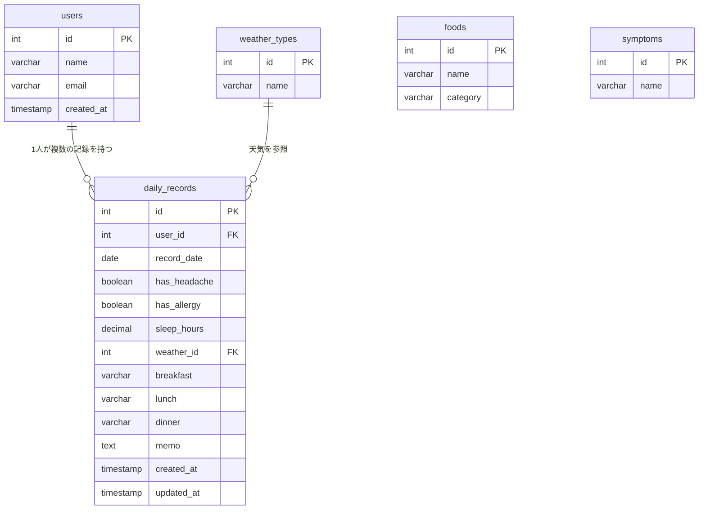

## ER図

```mermaid
erDiagram
    users ||--o{ daily_records : "1人が複数の記録を持つ"
    weather_types ||--o{ daily_records : "天気を参照"
    
    users {
        int id PK
        varchar name
        varchar email
        timestamp created_at
    }
    
    daily_records {
        int id PK
        int user_id FK
        date record_date
        boolean has_headache
        boolean has_allergy
        decimal sleep_hours
        int weather_id FK
        varchar breakfast
        varchar lunch
        varchar dinner
        text memo
        timestamp created_at
        timestamp updated_at
    }
    
    weather_types {
        int id PK
        varchar name
    }
    
    foods {
        int id PK
        varchar name
        varchar category
    }
    
    symptoms {
        int id PK
        varchar name
    }
```