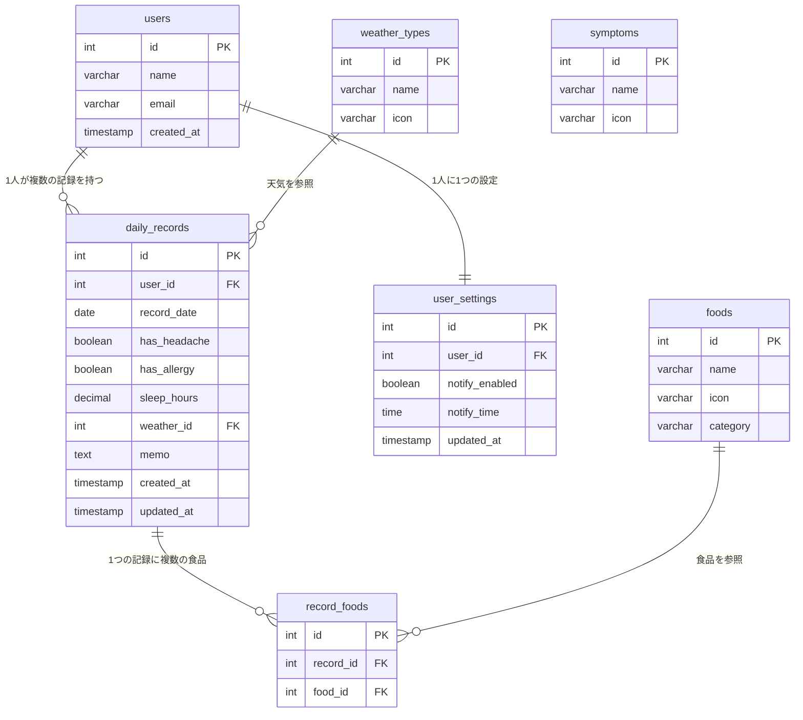
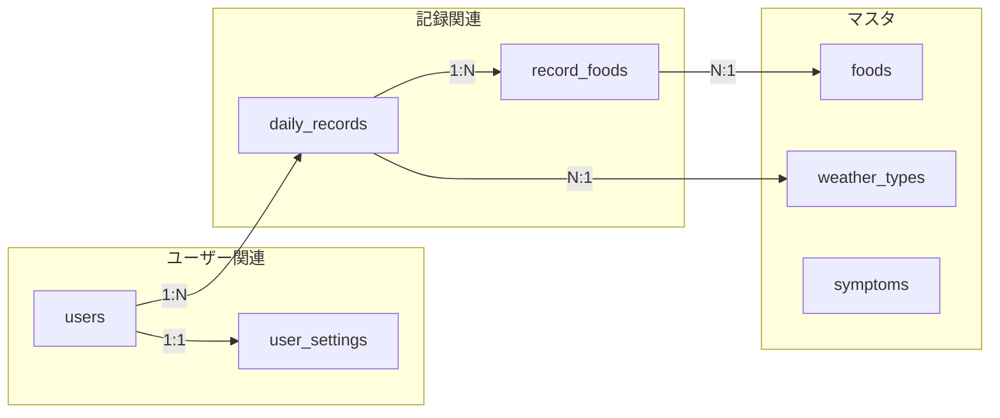

# TriggerSearch（trigs）ER図（更新版）

## ER図

---

## テーブル関連図（シンプル版）

---

## 食品マスタ（foods）初期データ

| id | name | icon | category |
|----|------|------|----------|
| 1 | パン・小麦 | 🍞 | 穀物 |
| 2 | 乳製品 | 🥛 | 乳製品 |
| 3 | 卵 | 🥚 | 卵 |
| 4 | 肉 | 🍖 | 肉類 |
| 5 | 魚 | 🐟 | 魚介類 |
| 6 | ごはん | 🍚 | 穀物 |
| 7 | 麺類 | 🍜 | 穀物 |
| 8 | 野菜 | 🥬 | 野菜 |
| 9 | 果物 | 🍎 | 果物 |
| 10 | お菓子 | 🍰 | 菓子 |
| 11 | コーヒー | ☕ | 飲料 |
| 12 | お酒 | 🍺 | 飲料 |

---

## 天気マスタ（weather_types）初期データ

| id | name | icon |
|----|------|------|
| 1 | 晴れ | ☀️ |
| 2 | 曇り | ☁️ |
| 3 | 雨 | 🌧️ |
| 4 | 雪 | ❄️ |

---

## 症状マスタ（symptoms）初期データ

| id | name | icon |
|----|------|------|
| 1 | 頭痛 | 🤕 |
| 2 | アレルギー | 🤧 |

---

## ユーザー設定（user_settings）デフォルト値

| カラム | デフォルト値 |
|--------|-------------|
| notify_enabled | true |
| notify_time | 21:00 |