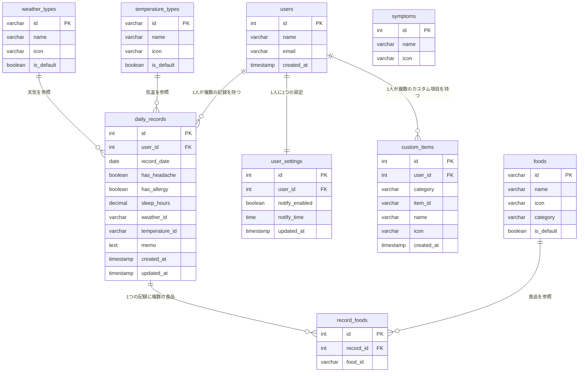
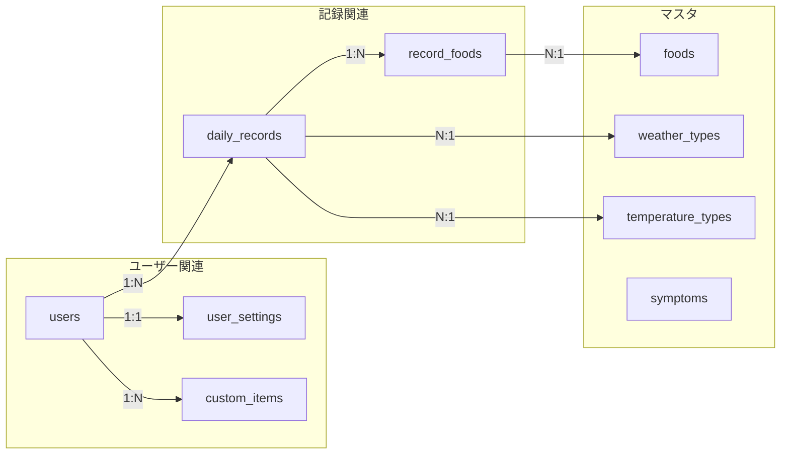

# TriggerSearch（trigs）ER図（v3）

## ER図

---

## テーブル関連図（シンプル版）

---

## テーブル詳細

### users（ユーザー）

| カラム | 型 | 説明 |
|--------|-----|------|
| id | INT | 主キー |
| name | VARCHAR(100) | ユーザー名 |
| email | VARCHAR(255) | メールアドレス |
| created_at | TIMESTAMP | 登録日時 |

### daily_records（毎日の記録）

| カラム | 型 | 説明 |
|--------|-----|------|
| id | INT | 主キー |
| user_id | INT | ユーザーID（FK） |
| record_date | DATE | 記録日 |
| has_headache | BOOLEAN | 頭痛あり？ |
| has_allergy | BOOLEAN | アレルギーあり？ |
| sleep_hours | DECIMAL(3,1) | 睡眠時間 |
| weather_id | VARCHAR(50) | 天気ID（FK） |
| temperature_id | VARCHAR(50) | 気温ID（FK） |
| memo | TEXT | メモ |
| created_at | TIMESTAMP | 作成日時 |
| updated_at | TIMESTAMP | 更新日時 |

### record_foods（記録と食品の中間テーブル）

| カラム | 型 | 説明 |
|--------|-----|------|
| id | INT | 主キー |
| record_id | INT | 記録ID（FK） |
| food_id | VARCHAR(50) | 食品ID（FK） |

### custom_items（カスタム項目）

| カラム | 型 | 説明 |
|--------|-----|------|
| id | INT | 主キー |
| user_id | INT | ユーザーID（FK） |
| category | VARCHAR(20) | カテゴリ（weather/temperature/food） |
| item_id | VARCHAR(50) | 項目ID（custom_xxx形式） |
| name | VARCHAR(100) | 項目名 |
| icon | VARCHAR(10) | 絵文字アイコン |
| created_at | TIMESTAMP | 作成日時 |

### user_settings（ユーザー設定）

| カラム | 型 | 説明 |
|--------|-----|------|
| id | INT | 主キー |
| user_id | INT | ユーザーID（FK） |
| notify_enabled | BOOLEAN | 通知ON/OFF |
| notify_time | TIME | 通知時間 |
| updated_at | TIMESTAMP | 更新日時 |

---

## マスタデータ

### 天気マスタ（weather_types）

| id | name | icon | is_default |
|----|------|------|------------|
| sunny | 晴れ | ☀️ | true |
| cloudy | 曇り | ☁️ | true |
| rainy | 雨 | 🌧️ | true |
| snowy | 雪 | ❄️ | true |

### 気温マスタ（temperature_types）

| id | name | icon | is_default |
|----|------|------|------------|
| hot | 暑い | 🥵 | true |
| warm | 暖かい | 😊 | true |
| cool | 涼しい | 🧥 | true |
| cold | 寒い | 🥶 | true |

### 食品マスタ（foods）

| id | name | icon | category | is_default |
|----|------|------|----------|------------|
| bread | パン・小麦 | 🍞 | 穀物 | true |
| milk | 乳製品 | 🥛 | 乳製品 | true |
| egg | 卵 | 🥚 | 卵 | true |
| meat | 肉 | 🍖 | 肉類 | true |
| fish | 魚 | 🐟 | 魚介類 | true |
| rice | ごはん | 🍚 | 穀物 | true |
| noodle | 麺類 | 🍜 | 穀物 | true |
| vegetable | 野菜 | 🥬 | 野菜 | true |
| fruit | 果物 | 🍎 | 果物 | true |
| sweets | お菓子 | 🍰 | 菓子 | true |
| coffee | コーヒー | ☕ | 飲料 | true |
| alcohol | お酒 | 🍺 | 飲料 | true |

### 症状マスタ（symptoms）

| id | name | icon |
|----|------|------|
| 1 | 頭痛 | 🤕 |
| 2 | アレルギー | 🤧 |

---

## デフォルト値

### user_settings

| カラム | デフォルト値 |
|--------|-------------|
| notify_enabled | true |
| notify_time | 21:00 |

---

以上
